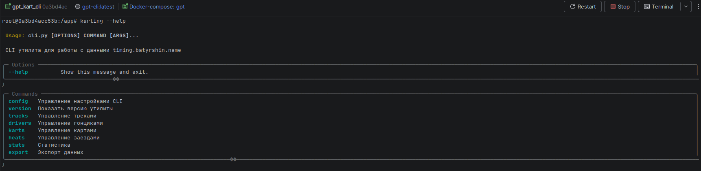
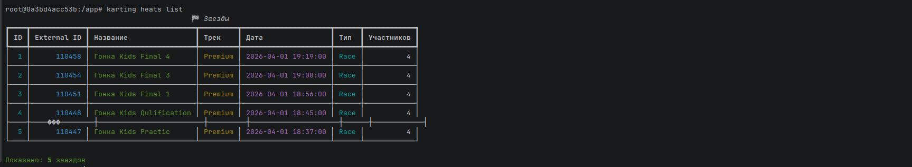
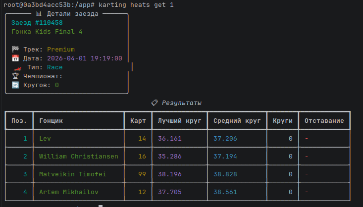
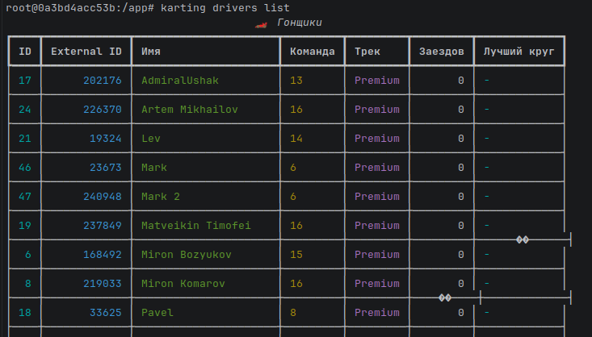
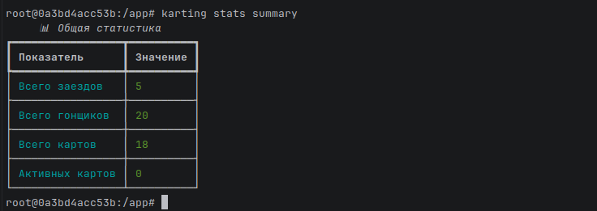
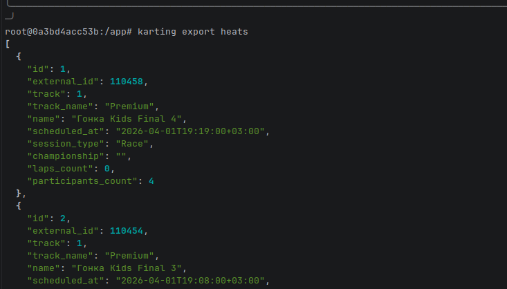

## 1. Подробное описание проекта

В этом пункте я опишу подробно, для чего конкретно собран проект, чем отличается он от уже известных решений
в этой сфере, чем он может быть полезен.

Парсингом таймингов в PitStop занимаются несколько независимых сайтов, самый популярный из которых - timing.batyrshin.name.

Сразу из названия можно понять, что под сайтом скрывается только интерфейс (то есть фронт). И правда, сайт - html/css/js
утилита, которая собирает тайминги с закрытого api сети PitStop.

В чем заключается проблема брать все данные напрямую от PitStop - не дали доступ :(. Я слезно просил, но мне не дали
так сделать.

Такие сайты занимаются только тем, что предоставляют гонщику красивый интерфейс и историю заездов за день и неделю. На
сервере не хранится долго информация о заездах. Как потом выяснилось информация удаляется на следующий день.

То есть у гонщика нету статистики, которая бы в удобном формате хранилась на сайте. Да там есть записи по тому, в какие дни
он участвовал в заездах (github - like), однако подробно заезды не сохраняются, что призван менять сервис.

На момент показа презентации (07.04) это прототип, в котором собран фукнционал сбора информации об участниках и её хранение
с удобным получение с помощью cli утилиты. Проект далек до финального облика и пока что показывает лишь фукнциональность
промптинга.

Масштабирование проекта подразумевает использования Celery для каждодневного сбора заездов. Доработка AI-инсайтов для гонщиков.
AI-инсайты реализованы на QWEN, через легковесный QWEN (локально).

## 2. Выбранные ИИ-инструменты

Выбранные ИИ-инструменты:
QWEN 3.5 Coder - Сильная опен-сорс модель от Алибаба, обладающей мультимодальностью, способной конкурировать с предыдущим
поколением ИИ-гигантов. Бесплатная модель распространения позволяет общаться с моделью сколько угодно.

Deepseek - Первая прорывная китайская опен-сорс модель от китайского студента из MIT. Заявилась как сильная альтернатива
ChatGPT. Также бесплатна.

## 3. Ожидания от сравнения

Я ожидаю, что QWEN сможет более структурировано подойти к разработке, модель более свежая, на момент начала разработки
только-только вышла эта версия, а на бенчмарках показывает сильные результаты.

Deepseek в свою очередь должен стать сильным в дебаге и скорости ответа, модель очень быстра на ответах, но часто выдает
не самый лучший результат.

## 4. Методология

### Как велось сравнение

Сравнение велось на одной и той же предметной области: парсинг `timing.batyrshin.name`, хранение данных в PostgreSQL,
построение REST API на DRF и разработка CLI-утилиты поверх этого API. Для каждой модели ставилась одна и та же базовая
задача, после чего развитие проектов шло параллельно, но независимо. Важным условием было не просто получить два похожих
репозитория, а довести каждую реализацию до рабочего состояния и при этом сохранить различия в архитектуре, наборе
команд CLI и подходах к расширению функциональности.

На практике сравнение строилось по этапам:
- подготовка ТЗ и архитектуры;
- проектирование моделей и структуры backend;
- реализация парсера;
- разработка REST API;
- реализация CLI;
- тестирование, дебаг и доработка документации.

### Критерии оценки

В качестве критериев оценки использовались:
- понимание контекста задачи;
- качество генерируемого кода;
- поддержка диалога и работа с уточнениями;
- скорость ответа;
- обработка ошибок и устойчивость решений;
- креативность и вариативность предложений;
- качество документирования;
- общая производительность в ходе разработки.

Оценка строилась не только по первому впечатлению от ответов модели, но и по тому, сколько правок требовалось после
генерации, насколько удобно было продолжать диалог, насколько хорошо модель удерживала ограничения ТЗ и насколько легко
полученный результат интегрировался в рабочий код.

### Процесс документирования

Процесс документирования велся параллельно разработке. Для фиксации использовались:
- история коммитов по этапам разработки;
- README-файлы внутри;
- отдельный файл [comparison.md](/home/vinandy/PycharmProjects/PitStopTimingParsing/comparison.md), в котором собраны промпты, тайминги, типичные ответы моделей и выводы по этапам.

Такой подход позволил восстановить и оформить не только итоговые различия между реализациями, но и сам процесс
взаимодействия с ИИ-инструментами: какие запросы использовались, какие проблемы возникали, как происходил дебаг и какие
решения в итоге были приняты в кодовую базу.

## 5. Установка и использование

Проект содержит две независимые реализации:
- `gpt/` - версия на базе DeepSeek;
- `qwen/` - версия на базе Qwen.

### Требования

Для локального запуска понадобятся:
- Python `3.13+`;
- `uv` как пакетный менеджер;
- Docker и Docker Compose;
- PostgreSQL, если запускать без Docker;
- для AI-функций в `qwen/` дополнительно может использоваться Ollama.

### Запуск версии `gpt`

Через Docker:

```bash
cd gpt
docker compose up --build
```

После запуска:
- backend: `http://localhost:8002`
- API: `http://localhost:8002/api`

Примеры использования CLI:

```bash
cd gpt/cli
karting tracks list
karting drivers get 1
karting heats latest --limit 5
karting export heats --format csv --output heats.csv
```

### Запуск версии `qwen`

Через Docker:

```bash
cd qwen
docker compose up --build
```

После запуска:
- backend: `http://localhost:8000`
- API: `http://localhost:8000/api`
- docs: `http://localhost:8000/api/docs/`

Примеры использования CLI:

```bash
cd qwen/cli
kartingkarting tracks list
kartingkarting drivers detail 1
kartingkarting heats detail 1
kartingkarting ai analyze-heat 1 --focus strategy
```

## 6. Описание API

Обе реализации используют собственный REST API на Django REST Framework, но набор ресурсов у них различается.

### API версии `gpt`

Базовый URL:

```text
http://localhost:8002/api
```

Основные endpoint-ы:
- `GET /api/tracks/`
- `GET /api/tracks/{id}/`
- `GET /api/drivers/`
- `GET /api/drivers/{id}/`
- `GET /api/karts/`
- `GET /api/karts/{id}/`
- `GET /api/heats/`
- `GET /api/heats/{id}/`

Назначение API:
- получение списка треков;
- просмотр пилотов и их статистики;
- получение данных по картам;
- просмотр списка заездов и детальной информации по ним.

### API версии `qwen`

Базовый URL:

```text
http://localhost:8000/api
```

Основные endpoint-ы:
- `GET /api/tracks/`
- `GET /api/tracks/{id}/`
- `GET /api/drivers/`
- `GET /api/drivers/{id}/`
- `GET /api/karts/`
- `GET /api/karts/{id}/`
- `GET /api/heats/`
- `GET /api/heats/{id}/`
- `POST /api/ai/generate/`

Документация:
- `GET /api/schema/`
- `GET /api/docs/`

Назначение API:
- доступ к справочникам и заездам;
- получение результатов по пилоту, карту и заезду;
- генерация AI-анализа по данным конкретного заезда.

## 7. Инструкция по тестированию

Тестирование проводится отдельно для backend и CLI каждой реализации.

### Запуск всех тестов из корня проекта

```bash
source .venv/bin/activate
cd /home/vinandy/PycharmProjects/PitStopTimingParsing
kartingpytest tests/test_repo.py -q
```

### Запуск тестов

`cd gpt/cli/` или `cd qwen/cli/`

`pytest -vv` - подробный
`pytest -q` - минимализм

Что проверяется тестами:
- работа CLI-команд;
- экспорт данных;
- обработка ошибок;
- устойчивость клиентских вызовов к мокированным HTTP-ответам.

## 8. Скриншоты работы

Для итогового отчета и GitHub-оформления рекомендуется приложить следующие скриншоты:
- запуск `gpt` backend и успешный ответ API;
- запуск `qwen` backend и открытая Swagger/OpenAPI документация;
- работа CLI-команды со списком пилотов;
- работа CLI-команды с деталями заезда;
- пример экспорта в `csv` или `json`;
- пример AI-анализа заезда в версии `qwen`;
- прохождение тестов для обеих реализаций.

Оптимальный набор скриншотов для защиты:
- окно терминала с `docker compose up`;
- окно терминала с успешным выполнением `python manage.py test` и `pytest`;
- окно браузера с `http://localhost:8000/api/docs/`;
- окно терминала с примерами команд CLI.

### Вставленные скриншоты

#### Справка по CLI



#### Список заездов



#### Детальная информация о заезде



#### Список гонщиков



#### Сводная статистика



#### Экспорт данных по заездам



### Скриншоты Qwen

#### Справка по CLI (Qwen)


#### Список пилотов (Qwen)


#### Детали пилота (Qwen)


#### Список заездов (Qwen)


#### Детали заезда (Qwen)


#### Список результатов (Qwen)


#### Статистика пилота (Qwen)


#### Экспорт JSON (Qwen)


